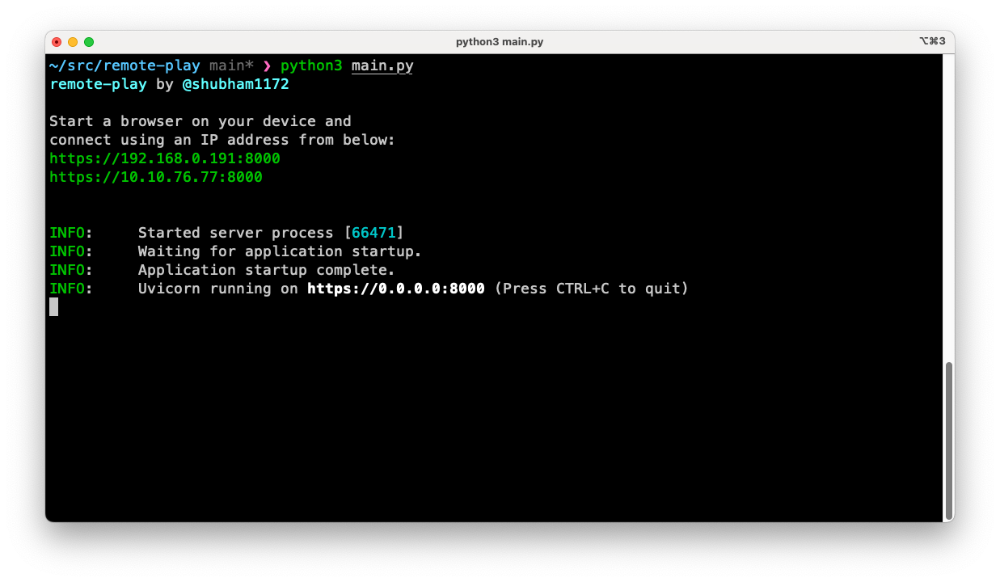
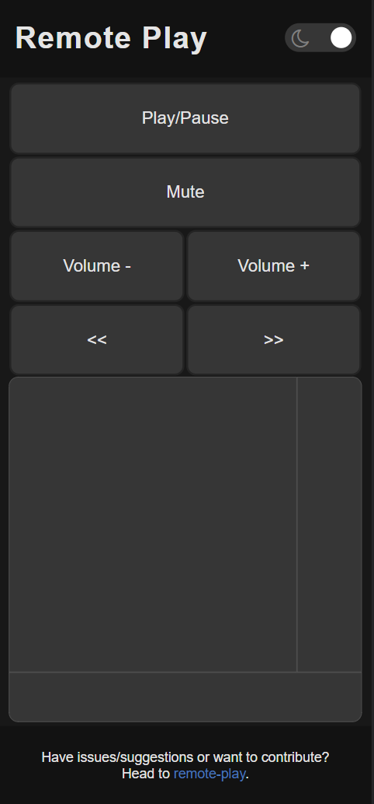

# Remote-Play

Remote-Play uses _pyautogui_ to press keyboard shortcuts to control your media. It uses _fastapi_ to serve a minimal UI to your mobile device.

Can be used with various players like Hotstar, Amazon Prime, Netflix, etc.

## Supported actions

The following actions are supported:

- Play/Pause (Toggle)
- Volume controls (+, -, and mute)
- Seek controls (<< and >>)
- Mouse cursor movement
- Left-mouse-button click using tapping
- Right-mouse-button click using double tap
- Swipe up and down to scroll vertically on the right pad

**Disclaimer**: Horizontal scrolling only supported on OS X / Linux Platforms

- Swipe left and right to scroll horizontally on the bottom pad

## Using Remote-Play

### Download the latest version

Get the latest stable version by heading to [Releases](https://github.com/shubham1172/remote-play/releases) and download the right release depending on your OS.

or

Get the development (unstable) version by heading to [Package workflow](https://github.com/shubham1172/remote-play/actions/workflows/package.yml). Click on the latest run and scroll down to find the `artifacts` associated and download the right one for your OS.

### Setup and installation

- Extract the zip from the step above and copy to any suitable location
- Set the environment variables `REMOTE_PLAY_HOST` (default="0.0.0.0") and `REMOTE_PLAY_PORT` (default=8000) to customize the web server's host and port. Alternatively, you can use the command line arguments `--host` and `--port`.

#### Using HTTPs

To use a secured connection,

- Set the environment variables, `REMOTE_PLAY_SSL_CERT` and `REMOTE_PLAY_SSL_KEY`, pointing to the SSL certificate and key files respectively. Alternatively, you can use the command line arguments `--ssl-key` and `--ssl-cert`.
- In a dev environment, you can use a tool like [mkcert](https://github.com/FiloSottile/mkcert) to generate certificates. Note, you should also update your browser's trusted certificates to not get a security warning each time you visit the app.

### Starting up

- Open the remote-play folder and start the app: remote-play.exe for Windows, remote-play for Linux/MacOS
- Navigate to the correct IP address from the console (depending on your network) on your device.

**Important**: Make sure that your media player is an active window.

|                                  Light Theme                                  |                                           Dark Theme                                           |
| :---------------------------------------------------------------------------: | :--------------------------------------------------------------------------------------------: |
|  |  |

## Contributing

All contributions to Remote-Play are welcome. Please see [CONTRIBUTING.md](/CONTRIBUTING.md) for more.
